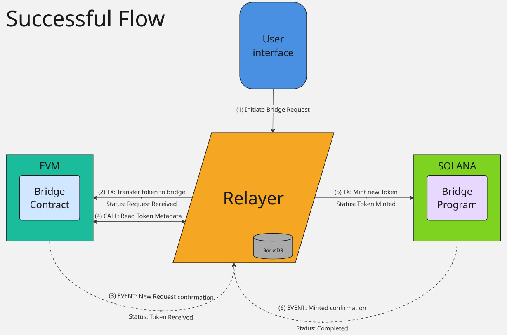

[](https://github.com/Arilucea/ArBridge/releases)
[](https://github.com/Arilucea/ArBridge/blob/main/LICENSE)

## Table of Contents
- [Overview](#overview)
- [Components](#components)
  - [Contracts](#contracts)
  - [Relayer](#relayer)
  - [Frontend](#frontend)
- [Getting Started](#getting-started)
- [Flow Diagrams](#flow-diagrams)
- [User Interface](#user-interface)
- [License](#license)

## Overview

ArBridge is a cross-chain NFT bridge that enables seamless transfer of NFTs between Solana and EVM-compatible blockchains. The bridge maintains token integrity and ownership across both networks while providing a user-friendly interface for managing transfers.

### Key Features
- Secure cross-chain NFT transfers
- Real-time request tracking
- Error recovery mechanisms
- Comprehensive event logging


## Components

### Contracts
The core smart contracts for both Solana and EVM networks are located in the `contracts` folder as a submodule. These contracts handle the locking and minting of NFTs during the transfer process.

### Relayer
The relayer component, found in the `relayer` folder, manages the migration of NFTs between networks. It monitors both chains for transfer requests and executes the necessary operations to complete the transfers.

### Frontend
The user interface for managing NFT transfers is located in the `frontend` folder. It provides a visual interface for creating, tracking, and managing bridge requests.

## Getting Started
### Installation

1. Clone the repository:
```bash
git clone https://github.com/Arilucea/ArBridge.git
cd ArBridge
```

2. Initialize submodules:
```bash
git submodule update --init --recursive
```

3. Follow the specific setup instructions in each component's README:
- [Contracts](contracts/README.md)
- [Relayer](relayer/README.md)
- [Frontend](frontend/README.md)

## Flow Diagrams

### Bridge Token


### Error Recovery Flows
- [Request Received](./docs/flows/RequestReceived.jpg)
- [Token Received](./docs/flows/TokenReceived.jpg)
- [Token Minted](./docs/flows/TokenMinted.jpg)

## User Interface

### Creating a Bridge Request
- [Solana to EVM](./docs/front/Create_Request_Sol_EVM.png)
- [EVM to Solana](./docs/front/Create_Request_EVM_Sol.png)

### Request Status
- [New Request](./docs/front/New_Request.png)
- [Check Request](./docs/front/Check_Request.png)
- [Pending Requests](./docs/front/Pending_Requests.png)
- [Completed Requests](./docs/front/Completed_Requests.png)

## License

This project is licensed under the MIT License - see the [LICENSE](LICENSE) file for details.
